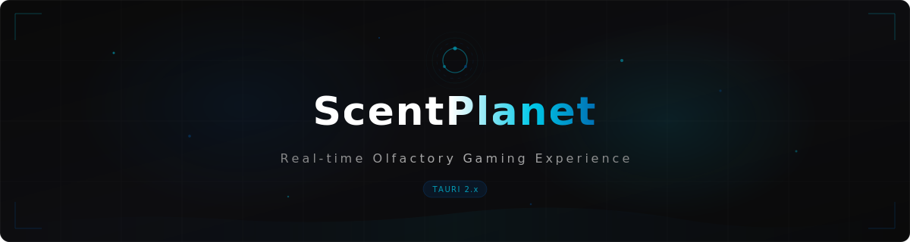

<!-- ScentPlanet -->

<picture>
  <source media="(prefers-color-scheme: dark)" srcset="assets/hero-banner.svg">
  <source media="(prefers-color-scheme: light)" srcset="assets/hero-banner.svg">
  
</picture>

 

&nbsp;&nbsp;
&nbsp;&nbsp;
&nbsp;&nbsp;

  

**感受每一个世界。**
 
游戏的全新感官 &mdash; AI 驱动的实时气味同步。

 

[**下载**](https://github.com/ScentPlanet/scentplanet/releases/latest) &nbsp;&bull;&nbsp; [Discord](https://discord.com/channels/1450784037886103605/1450793325228458095) &nbsp;&bull;&nbsp; [报告问题](https://github.com/ScentPlanet/scentplanet/issues/new?template=bug_report.yml) &nbsp;&bull;&nbsp; [功能建议](https://github.com/ScentPlanet/scentplanet/issues/new?template=feature_request.yml)

 

<a href="README.md">English</a> &nbsp;|&nbsp; 简体中文

 

---

 

## 游戏的全新感官。

当气味弥漫，游戏世界鲜活了起来。踏入森林，深吸一口气。无需模组，无需插件。只管玩 &mdash; 剩下的交给 ScentPlanet。

 

 

---

 

## 工作原理

ScentPlanet 看见你所见。它实时理解你的游戏世界 &mdash; 森林、篝火、旷野 &mdash; 并即刻回应。

 

**01 &mdash; 它看见你所见。**
 
AI 视觉实时分析你的屏幕。不只是像素 &mdash; 它理解你*身处*游戏世界的哪个位置。

**02 &mdash; 六种气息，万千世界。**
 
可更换香薰仓让每个场景触手可及。松木、烟火、青草 &mdash; 就在你身边。

**03 &mdash; 每一款游戏，即刻适配。**
 
无需模组。通过 AI 视觉适配任何游戏。荒野大镖客2、我的世界、GTA、艾尔登法环 &mdash; 直接开玩。

 

---

 

## 为你热爱的世界而生。

从新奥斯汀的旷野，到 Minecraft 洞穴深处。每个世界都有它的气息。

| | 游戏 | 工作室 | 环境 |
|:--|:-----|:-------|:-----|
| | **荒野大镖客：救赎2** | Rockstar Games | 草原、森林、沙漠、篝火、烹饪、花田 |
| | **我的世界** | Mojang Studios | 森林、篝火、花田、烹饪 |
| | **每一个开放世界** | 通用 | 通过 AI 视觉适配任何游戏 |

> 为任何游戏创建自定义气味配置。将环境映射到香薰仓。通过 [game-profiles](https://github.com/ScentPlanet/game-profiles) 与社区分享。

 

---

 

## 下载

**最新版本：v0.3.7**

 

  

Windows 10/11（64位）&nbsp;&bull;&nbsp; 4GB 内存 &nbsp;&bull;&nbsp; 蓝牙 LE &nbsp;&bull;&nbsp; 内置自动更新

 

macOS 和 Linux &mdash; 即将推出

 

---

 

## 技术驱动

| 层级 | 技术 |
|:-----|:-----|
| 桌面端 | [Tauri 2.x](https://tauri.app) &mdash; Rust 后端 + WebView 前端 |
| 前端 | React 19、TypeScript 5、Vite 6、Zustand 5 |
| AI 视觉 | 云端 VLM（通过 [OpenRouter](https://openrouter.ai)） |
| 硬件 | ESP32-C3 BLE + Web Bluetooth API |
| 音频 | Rust 原生实时 DSP 事件检测 |
| 国际化 | 英文、简体中文、繁体中文 |

 

---

 

## 社区

- [**Discord**](https://discord.com/channels/1450784037886103605/1450793325228458095) &mdash; 加入社区
- [**报告问题**](https://github.com/ScentPlanet/scentplanet/issues/new?template=bug_report.yml)
- [**功能建议**](https://github.com/ScentPlanet/scentplanet/issues/new?template=feature_request.yml)
- [**讨论区**](https://github.com/ScentPlanet/scentplanet/discussions)
- [**更新日志**](CHANGELOG.md)

 

---

 

<strong>常见问题</strong>

 

**需要专用硬件吗？**
 
是的 &mdash; ScentPlanet 需要配套的 BLE 气味设备（6个气味仓）。

**AI 费用是多少？**
 
场景识别使用 OpenRouter 的云端 VLM API。每次游戏会话费用约 $0.001–0.005。需要自备 API 密钥。

**可以自定义气味强度吗？**
 
可以 &mdash; 支持逐环境强度设置、全局控制和嗅觉适应参数调节。

 

---

 

ScentPlanet 在本地处理截图，并发送至你配置的 VLM API。我们不存储或收集游戏数据。[隐私政策](docs/privacy.md) &nbsp;&bull;&nbsp; [硬件指南](docs/hardware-guide.md)

  

  

**ScentPlanet** &mdash; 感受每一个世界。

 

[版本发布](https://github.com/ScentPlanet/scentplanet/releases) &nbsp;&bull;&nbsp; [Discord](https://discord.com/channels/1450784037886103605/1450793325228458095)

 

